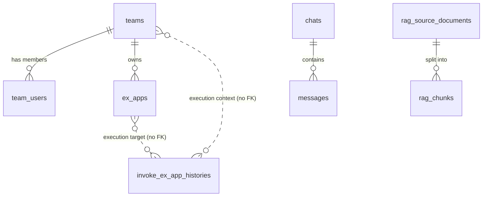

# データベース設計

業務 DB は PostgreSQL 16。上流の DynamoDB シングルテーブル設計を、エンティティ単位に正規化した 7 テーブルへ置き換える。RAG 用には pgvector（ベクトル検索）と pg_bigm（全文検索）の拡張テーブルを追加する。ORM は Prisma（driver-adapter、schema は api リポ側）。

## 1. 業務テーブル（7）

| テーブル | 種別 | 概要 |
|---|---|---|
| `teams` | マスタ | チーム |
| `team_users` | 中間（N:M） | チーム所属。`is_admin`（チームスコープ admin）/ `username`（表示名スナップショット） |
| `chats` | アクティブ | チャットセッション |
| `messages` | アクティブ/履歴 | メッセージ（`content` は JSONB マルチパート、`feedback` 等） |
| `system_contexts` | アクティブ | システムプロンプト保存 |
| `ex_apps` | マスタ | 追加 AI アプリ（ExApp）定義 |
| `invoke_ex_app_histories` | 履歴 | ExApp 実行履歴（非正規化スナップショットを意図的に保持・FK なし） |

設計方針：

- マスタ系は正規化、履歴・スナップショット系は非正規化を維持
- ID は `TEXT`（アプリ層で UUID を生成して挿入）。将来のデータ移行性を考慮し DB 自動採番にしない
- 認証は `user_id TEXT` で抽象化（Keycloak の `sub` を受ける）
- TTL は `expire_at` カラム + 定期削除で実現
- 大容量データ（base64 / 閾値超）は SeaweedFS に退避し、URL を保持

### 認可 2 層

- **層 1（グローバルロール）**：Keycloak グループ（JWT クレーム）
- **層 2（チームスコープ admin）**：`team_users.is_admin`

`isTeamAdmin(teamId)` は層 1（JWT に管理者グループ）AND 層 2（DB の `is_admin=true`）の AND 判定。

## 2. RAG テーブル（pgvector + pg_bigm）

RAG 取込・検索用に以下を追加する（migrate ステージで自動適用）。

| テーブル | 概要 |
|---|---|
| `rag_source_documents` | 取込元ドキュメント |
| `rag_chunks` | チャンク。`embedding vector(768)`（HNSW インデックス）+ 本文（pg_bigm GIN インデックス） |

検索はベクトル類似度（pgvector）と全文（pg_bigm）を RRF で統合し、必要に応じ cross-encoder リランカで並べ替える（[llm-abstraction.md](./llm-abstraction.md) §4）。

## 3. ER 図

