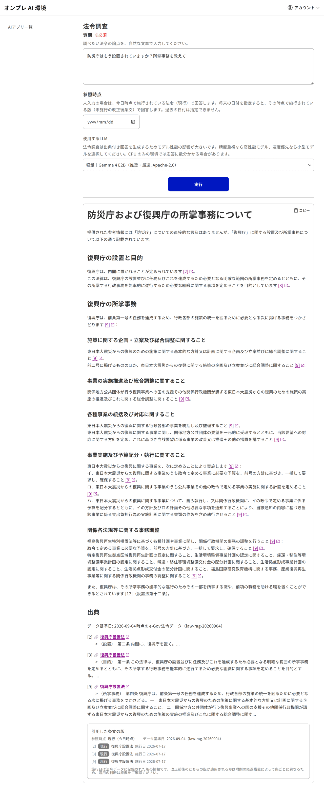
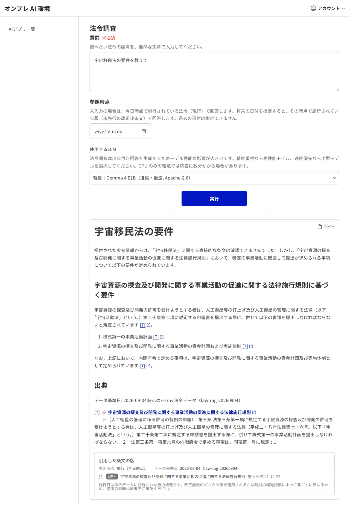

# 法令 RAG の検索経路と 3 値応答（上流との差分）

本書は、法令調査（法令 RAG）の**検索経路**と、そこに入れたオンプレ固有の変更を、上流オリジナルとの
差分として明示するものです。ユーザー向けの機能差分は [../onpre-vs-upstream.md](../onpre-vs-upstream.md)、
データの作り方は [../law-rag-setup.md](../law-rag-setup.md) を参照してください。

> **非提携**：本プロジェクトは上流（デジタル庁の `genai-ai-api` 等）および同梱 OSS とは無関係・非公式です。
> 本書は互換・識別のための説明です（[DISCLAIMER.md](../../DISCLAIMER.md)）。

---

## 1. 上流の検索構造（移植元）

移植元は上流の法令調査アプリ（`lawsy-custom-bq`）で、検索は **法令名ベースの 4 段階**です。

| 段 | 内容 |
|---|---|
| 段1 | クエリ → **法令名**を推定（上流は Gemini ＋ Google 検索 grounding） |
| 段2 | 法令名の embedding で **最近傍 1 件の法令を特定**し、その法令の条文を丸ごと取得 |
| 段3 | LLM が関連条文を選別 |
| 段4 | LLM がレポートを生成 |

重要な性質が 2 つあります。

- 検索に使う embedding は **法令名のみ**。条文本文のベクトル検索は行わない（関連性判定は段3 の LLM が担う）。
- 段2 は **距離の絶対値をどこでも見ていない**。必ず最も近い 1 件が返る。

上流ではこの 2 点目の穴を **Google 検索 grounding** が塞いでいました。段1 が web を見て法令名を決めるため、
「存在しない法令」がそもそも段2 へ渡らない構造です。

---

## 2. オンプレで顕在化した欠陥

オンプレ版には web がありません（段1 はローカル LLM の知識のみ）。その結果、次が起きます。

> 「防災庁はもう設置されていますか」→ **復興庁設置法**の条文を根拠に回答（2026-08-01 実測）

機序（実測で確認）:

1. 段1 のローカル LLM は新設官庁の法律を知らず、法令名の推定が**空**になる
2. 空のときのオンプレ独自フォールバックが、クエリ自体を embedding して法令名の近傍検索をする
3. 段2 が**最も近い 1 件を無条件に採る**ため「◯◯庁設置法」群から別法令が選ばれる
4. 段3・段4 は特定された法令の条文しか見ていないので、誠実に要約して返す

加えて、e-Gov の全版データを持ちながら**未施行版へ到達する経路が無い**ため、本来「まだ施行されていない」と
答えるべき質問が「誤った現行法の条文」にすり替わっていました。

実際の画面です。質問は「防災庁はもう設置されていますか？所掌事務を教えて」で、見出しからして
「防災庁**および復興庁**の所掌事務について」と両者が混ざり、本文・出典とも**すべて復興庁設置法**になっています。



存在しない法令を尋ねた場合も同じです。「宇宙移民法の要件を教えて」に対し、名前の近い
**宇宙資源法施行規則の条文が出典付きで提示**されます。



---

## 3. 上流との差分（一覧）

| 項目 | 上流オリジナル | オンプレ版 |
|---|---|---|
| 段1 法令名推定 | Gemini ＋ Google 検索 grounding | ローカル LLM の知識のみ＋**通称辞書**（`LAW_RAG_ALIASES_FILE`） |
| 段1 が空のとき | （web が埋めるので通常起きない） | クエリ自体を embedding して法令名を近傍検索（**オンプレ独自追加**） |
| 段2 法令特定 | 法令名 embedding の**最近傍 1 件を無条件採用** | **一致の強さで階層化した判定**（§4）。固有部分の一致を必須条件にする（**オンプレ独自**） |
| 応答の種類 | 「回答」／「法令を特定できない」の 2 値 | **【現行】／【施行予定】／【該当なし】の 3 値**（**オンプレ独自**） |
| 未施行条文 | 経路なし | **【施行予定】として案内**（e-Gov 全版データを持つ本配布物だけが返せる） |
| 段3 へ渡す候補 | 法令の全条文（巨大 context 前提） | 特定法令の内側でクエリ近傍 top-K に事前圧縮（**オンプレ独自**・小型 LLM 対策） |
| 段3 の事前圧縮 | なし | `content_embedding` ベクトル ＋ pg_bigm 全文の **RRF 融合** |
| 参考情報 | web 検索結果 ＋ URL コンテキスト ＋ 条文 | **条文のみ**（web 参照は全廃） |
| reranker | なし | 一般 RAG 側にのみ存在。**法令 RAG の段2 では使わない**（§7） |

---

## 4. 段2 の判定階層（3 値応答）

段2 を「最近傍 1 件」から、一致の強さで階層化した判定へ置き換えました。**距離の絶対値ではなく、
法令名の固有部分が一致するかどうか**で採否を決めます。

```
段2-Q  利用者がクエリ本文で名乗った法令が手元に 1 つも無い ⇒【該当なし】（推定器を見るまでもない）
段2-0  法令名マスタに対する正規化完全一致
段2-2  固有部分（識別子）の比較キーが完全一致        ← 通称と正式名称の助詞差を吸収
段2-3  pg_bigm 全文 ＋ 法令名ベクトルの RRF 候補
         固有部分が一致する候補だけ採用
         全滅なら ⇒【該当なし】＝条文を一切出さない
       ↓ ヒットした法令を本則条文の施行状態で分類
         施行済みの本則条文がある ⇒【現行】（従来と同一の回答）
         本則が 1 条も施行されていない ⇒【施行予定】
```

### 4-0. なぜ段2-Q が要るのか

固有部分のゲートは「**推定器が挙げた法令名**」を検査します。ところが推定器は、知らない法令を訊かれたとき
**実在する別の法令**を挙げてくることがあります（実測：「人工知能人格権法の適用範囲は」→ 民法／個人情報の
保護に関する法律／著作権法）。名前としては実在するのでゲートを素通りし、民法の条文で回答してしまいます。

利用者が名指しした法令こそが問いの主語なので、**それが手元に無いなら、推定器が何を挙げていても条文は
出しません**。名乗りの無いクエリ（大半の内容質問）はこの段を素通りします。

### 4-1. なぜ閾値では切れないのか（実測）

| 比較 | `bigm_similarity`（pg_bigm 1.2 実測） |
|---|---|
| 防災庁設置法 ↔ 復興庁設置法 | **0.5714** |
| 「防災庁はもう設置されていますか」↔ 防災庁設置法 | 0.25 |
| 「防災庁はもう設置されていますか」↔ 復興庁設置法 | 0.0625 |

pg_bigm の既定 `similarity_limit` は 0.3 です。「◯◯庁設置法」同士は `庁設`／`設置`／`置法` を共有するため、
**表層類似度の閾値では別法令を弾けません**。法令名の識別力は先頭の固有部分（防災／復興）にあります。

一方、クエリとの比較では bigm が正しく効きます（0.25 対 0.0625）。そこで **bigm は候補を作るためだけに使い、
採否は固有部分の一致で決める**という役割分担にしています。

### 4-2. 「施行予定」の判定粒度は法令ではなく本則条文

「現行の索引に在るか」では判定できません。e-Gov の一括データでは、**未施行の新法でも附則第一条（施行期日）は
公布日施行で現行版になる**ためです。実測（2026-09-19 時点のデータ）:

| | 件数 |
|---|---|
| 法令名マスタの法令数 | 7,826 |
| 現行条文をまったく持たない法令 | **0** ← 法令単位では判定不能 |
| 本則が 1 条も施行されていない法令（＝【施行予定】） | **11** |
| 本則を持たず附則だけで完結する現行法令（廃止政令等・誤判定してはいけない群） | 42 |
| 現行かつ将来改正を持つ法令 | 192 |

例：防災庁設置法（令和八年法律第六十一号）は、現行条文が**附則第 1 条・第 6 条の 2 件のみ**（2026-07-17 施行）、
本則第 1〜19 条と附則第 2〜5 条は未施行です。

### 4-3. 施行日を断定しない

防災庁設置法 附則第一条の実文は「**令和八年十二月三十一日までの間において政令で定める日から施行する**」です。
データ上の版日付 2026-12-31 は施行日そのものではなく**上限**です。そのため【施行予定】の応答では、
版日付だけでなく**附則の施行期日規定の本文をそのまま LLM へ渡し**、日付を断定させない指示を添えています。

---

## 5. 固有部分（識別子）の抽出規則

法令名は「固有部分 ＋ 定型の法形式接尾辞」という定型なので、規則ベースで足ります（形態素解析器は不要）。

1. **正規化**：NFKC（全角半角統一）→ 空白除去 → 括弧書き除去 → 制定番号（「◯年法律第 N 号」）除去
   - 題名が制定番号だけの旧法令（例「大正三年法律第三十七号（公共団体ノ管理スル…法律）」）は、
     括弧内が実質の題名なのでそちらを採る
2. **接尾辞剥がし**：`設置法` / `に関する法律` / `の一部を改正する法律` / `施行令` / `施行規則` /
   `組織令` / `法` などを長い順に反復して剥がす
3. **短縮の歯止め**：剥がして 2 文字未満になる場合（「民法」→「民」）は**名称全体**を識別子にする
4. **比較キー**：助詞（の・に・を・は…）と末尾の「等」を落として比較する
   （「個人情報保護」と「個人情報の保護」を同一視。語中の「等」は「均等」「高等」を壊すので残す）

### 5-1. 法令名マスタ 7,826 件に対する網羅率（実測）

| 測定 | 結果 |
|---|---|
| 識別子が空になる法令 | **0 件** |
| 別主題どうしで識別子が衝突する法令 | **0 件**（網羅率 100.00%） |
| 同一キーの群 | 1,391 群 — すべて「◯◯法／◯◯法施行令／◯◯法施行規則」型の**同一主題** |

同一主題の同族が同じ識別子を持つのは設計どおりです。識別子は**棄却にしか使わない**必要条件であり、
法令そのものの選択は段2-0 の完全一致が行います。したがって**例外表は不要**という結論になりました。

### 5-2. 「包含」を採らなかった理由

当初は「片方が他方を含む」も一致とみなす案を検討しましたが、`会社法` ⊂ `会社更生法` が通ってしまい、
**別の法律を根拠として提示する**誤りを許すため採用していません。通称と正式名称の距離は、上流の web
grounding の代わりに置いた通称辞書（2,698 件）が先に吸収します。

### 5-3. クエリ側の照合も 2 段構え

段1 が沈黙した経路では、候補の固有部分を**クエリ本文**と突き合わせます。ここも単純な部分文字列の包含では
不足でした。「宇宙移民法の要件は」には「**民**法」が部分文字列として含まれるため、法令名マスタ 7,826 件の
全数探索で**民法が通ってしまう**ことを検出しました（2026-09-19）。

そこで次の 2 段にしています。

1. クエリが法令名らしき語を名乗っているとき（「宇宙移民法の要件は」の「宇宙移民法」）は、**その語と
   候補の固有部分どうし**を突き合わせる（抽出規則は段1 と共有）
2. 法令名を名乗らない自然文（「防災庁はもう設置されていますか」）は、突き合わせる語が無いので
   固有部分がクエリ本文に現れるかで判定する

この形で、想定した「存在しない法令」クエリ 5 種に対し、**7,826 件のうち 1 件も通過しない**ことを
全数探索で確認しています。同時に「防災庁はもう設置されていますか」は**防災庁設置法 1 件だけ**が通ります。

---

## 6. 3 値応答の中身

| 判定 | 応答 |
|---|---|
| **【現行】** | 従来と同一の回答（後方互換） |
| **【施行予定】** | 「まだ施行されていない」を回答の冒頭で述べ、施行日と附則の施行期日規定を添えたうえで、**施行後の内容**として条文を案内する |
| **【該当なし】** | 条文を一切提示せず、該当が見当たらない旨だけを返す。**近い名称の別法令を推測で提示しない** |

同じ質問を、判定階層を入れた後で実行した画面です。**防災庁設置法を特定**したうえで「まだ施行されて
いません」から書き始め、条文は施行後の内容として案内しています。引用した条文の版は**すべて「施行予定」**
（2026-12-31 施行）で、復興庁は 1 件も出ていません。


存在しない法令には、**条文を 1 件も出さずに**該当が見当たらない旨だけを返します。出典セクションも
版の一覧も表示されません。


【該当なし】と判定したときに棄却した候補はログに残ります（将来、判定を緩める余地を検討するため）。

法令データが投入されていない環境（開発用 DB など）では法令名マスタが空になるため、**従来経路
（最近傍 1 件）へ自動フォールバック**します。この経路は 2 値のままです。

---

## 7. 測定結果（2026-09-19・`gemma4:e2b`・同梱データ）

`deploy/scripts/law-queries.json` の 40 問（既存 20 問＝回帰の基準線、追加 20 問＝negative case）で、
**同一の法令名推定を旧経路（最近傍 1 件）と新経路（判定階層）へ同時に流して**比較しました。

### 主指標：False Positive 率（該当が無いのに条文を提示した率）

| 経路 | 結果 |
|---|---|
| 旧（最近傍 1 件・2 値） | **5/5（100%）** |
| 新（判定階層・3 値） | **0/5（0%）** |

「宇宙移民法」「メタバース土地登記法」「時間旅行規制法」「感情税法」「人工知能人格権法」のいずれも、
旧経路は 30 条文を提示して回答していました。新経路はいずれも条文を出しません。

### 副指標：既存 20 問の回帰

| 指標 | 旧 | 新 |
|---|---|---|
| 法令名推定 hit（経路非依存） | 18/20 | 18/20 |
| 法令特定 hit | 17/20 | **18/20** |
| 正解フレーズの再現 | 7/20 | **8/20** |
| 【現行】以外へ落ちた件数 | — | **0** |

**安全側へ倒したにもかかわらず、基準線は下がらず 1 問改善**しました。改善分は「不当な取引制限の要件は」で、
通称辞書の値が制定番号スタイルの題名（`昭和二十二年法律第五十四号（私的独占の禁止…）`）だったものが、
§5 の括弧フォールバック規則で正しく引けるようになったためです。

### 判定一致（3 値・40 問中 35）

| 群 | 一致 |
|---|---|
| 存在しない | 5/5 |
| 紛らわしい近接名 | 5/5（防災庁→施行予定／復興庁→現行 を含む） |
| 内容クエリ（回帰監視） | 5/5 |
| 未施行のみ | **0/5** ← §7-1 |

### 7-1. 判明した限界：施行予定へ到達できる条件

【施行予定】に到達できるのは、**クエリが法令の固有部分を名乗っている場合**です。

- 「**防災庁**はもう設置されていますか」→ 到達できる（固有部分「防災庁」がクエリに出る）
- 「重要品種の育成に関する**基本方針**は」→ 到達できない（法令名の固有部分がクエリに出ない）

新法は定義上ローカル LLM の知識に無いため、推定器は沈黙するか、**関連する既存の現行法**を挙げます
（実測：「太陽電池廃棄物の再資源化の義務は」→ 廃棄物の処理及び清掃に関する法律）。後者の場合、その現行法
自体は実在するので【現行】として回答されます。これは「誤った条文を根拠にする」害ではありませんが、
「新法がある」ことには気づけません。

ここを超えるには条文本文の意味検索（法令名を経由しない検索）が要り、それは上流の忠実移植から離れる
変更なので、本書の範囲では採っていません（§8）。

## 8. 採らなかった選択肢

- **段2 への reranker 適用**：段2 は「法令名で 1 法令を特定する」構造で、並べ替える候補集合が検索の出口に
  存在しないため効きません。一般 RAG 側（`RagService.retrieve`）で効果が出たのは別経路の話です。
  段3（条文選別）への適用はレイテンシ対策として別途検討します。
- **条文本文 embedding による検索への全面移行**：上流の忠実移植から大きく離れるため採っていません。
  本文ベクトルは「特定済み法令の内側で候補を圧縮する」用途にとどめています。
- **追加 OSS の導入**：pg_bigm はすでにバージョン固定の基準線に載っており、新規の依存は増やしていません。
- **データ・スキーマの変更**：施行日と未施行フラグは既存のスキーマにあり、本変更はコード改修だけで
  完結します。配布データのタグは据え置きです。

---

## 9. 出典

- 移植元 retrieve: https://github.com/digital-go-jp/genai-ai-api/tree/main/google-cloud/lawsy-custom-bq
- pg_bigm 公式ドキュメント: https://pgbigm.osdn.jp/pg_bigm-1-2.html
- e-Gov 法令データ一括ダウンロード: https://laws.e-gov.go.jp/bulkdownload/
