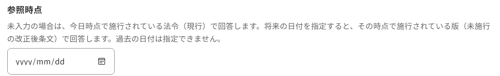
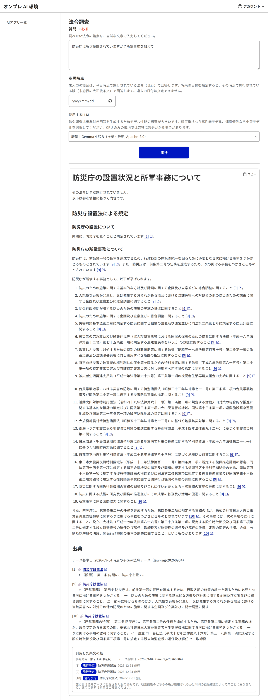
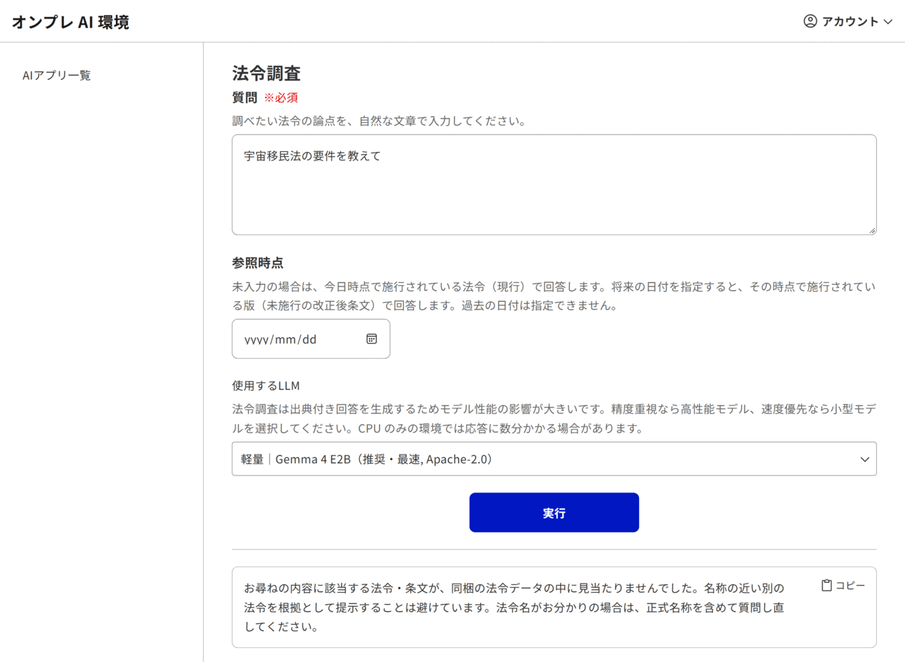
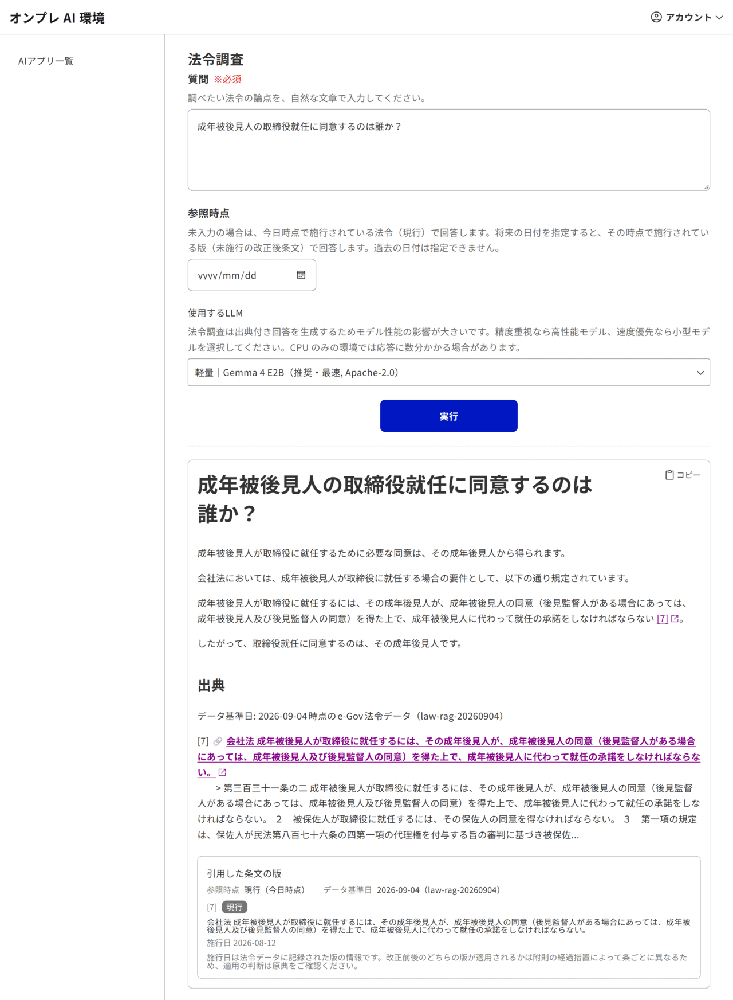
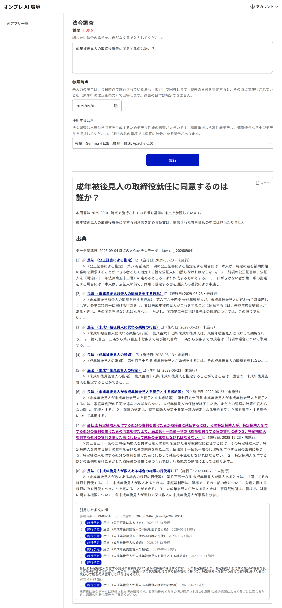
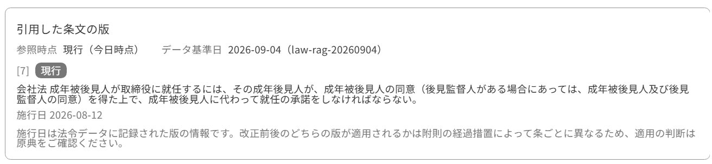

# オンプレ版と上流オリジナルの違い・使い方

本書は、上流オリジナル（クラウド前提の源内：`genai-web` / `genai-ai-api`）と、本オンプレ配布物
（`genai-web-onpre` / `genai-ai-api-onpre` / `genai-deploy-onpre`）の**違い**と、その違いから生じる
**オンプレ固有の使い方**をまとめたものです。

> **非提携**：本プロジェクトは上流（デジタル庁の `genai-ai-api` / `genai-web` 等）および同梱 OSS とは
> **無関係・非公式**です。本書は互換・識別のための説明であり、提携・公認を意味しません
> （詳細は [DISCLAIMER.md](../DISCLAIMER.md)）。

---

## 1. 全体像（共通）

源内 Web は「AI インターフェース」として機能し、AI アプリを実行する「AI 環境」（API 側）と連携します。
この役割分担は上流オリジナルとオンプレ版で共通です。

| 役割 | 上流オリジナル | オンプレ版 |
|---|---|---|
| AI インターフェース（Web フロント） | `genai-web` | `genai-web-onpre` |
| AI 環境（AI アプリ API） | `genai-ai-api` ほか（クラウド上の関数群） | `genai-ai-api-onpre`（単一の Express API） |
| 配布・基盤 | クラウド向け公式構成 | `genai-deploy-onpre`（単一の docker compose） |

---

## 2. 何が違うのか（基盤の置き換え）

機能の見た目・使い勝手はほぼ同等です。**主な違いは、クラウドマネージドサービスを OSS に置き換えて
単一ホストで動かせるようにした点**にあります。

| 用途 | 上流オリジナル（クラウド） | オンプレ版（OSS） |
|---|---|---|
| 認証・ユーザー管理 | Amazon Cognito | Keycloak |
| オブジェクトストレージ | Amazon S3 | SeaweedFS（S3 互換・保存時暗号化） |
| メール送信 | Amazon SES | Mailpit（開発用 SMTP）／本番は外部 SMTP |
| 非同期キュー | Amazon SQS | ElasticMQ（SQS 互換） |
| データベース | Amazon DynamoDB | PostgreSQL（+ pgvector / pg_bigm） |
| 大規模言語モデル | クラウドの LLM サービス | Ollama（CPU 可・既定）／vLLM（GPU・任意） |
| ベクトル検索 | クラウドのマネージド検索 | pgvector + pg_bigm（ハイブリッド検索） |
| ログ閲覧 | クラウドのログ基盤 | Dozzle（ブラウザでコンテナログ閲覧） |
| 配信・リバースプロキシ | クラウドの配信／API ゲートウェイ | nginx（自己署名 TLS） |
| デプロイ | クラウドの IaC（公式構成） | docker compose |

> 逆方向（クラウド → OSS）の対応の詳細は [docs/development/oss-migration.md](./development/oss-migration.md) を参照してください。

---

## 3. 機能の差分

### 3-1. 同等に使えるもの

- 汎用 AI アプリ：チャット／文章生成／翻訳／画像生成／ダイアグラム生成
- 追加 AI アプリ（ExApp・外部 REST API 連携）：入力フォーム（テキスト／数値／テキストエリア／ファイル／
  セレクト／チェックボックス／ラジオ／hidden）、会話履歴（疑似チャット）、同期・非同期実行、
  ファイル成果物（artifacts）のダウンロード
- チーム／メンバー／AI アプリの管理と権限ロール（システム管理者・チーム管理者・一般メンバー）
- 共通アプリチーム（全ユーザーが利用できる AI アプリ）

> 入力フォームの仕様（登録 JSON の各コンポーネント）は上流の「AI アプリ API 仕様」に準拠します。

### 3-2. 仕組みが異なるもの（オンプレ固有の運用が必要）

| 項目 | 上流オリジナル | オンプレ版 |
|---|---|---|
| ユーザーの追加 | Cognito のセルフサインアップ／管理画面／招待 | **招待制**：管理者が Keycloak にユーザーを作成（[使い方](#4-オンプレ固有の使い方ユーザーとメール)） |
| 初期管理者 | クラウド構成のスクリプトで付与 | 起動時に `admin`（システム管理者）を 1 名自動投入 |
| 追加の管理者付与 | クラウド側のグループ操作 | 付属スクリプトで Keycloak グループへ付与 |
| メール送信 | SES | 既定は Mailpit（実送信せず UI で確認）／本番は外部 SMTP に切替 |

### 3-3. 法令調査（法令 RAG）—— オンプレ版だけが返せる応答がある

法令調査は、e-Gov の法令データを同梱して**手元だけで**動かします。上流はクラウドの LLM と
**Google 検索 grounding** を併用しますが、オンプレ版は web を参照しません。この違いから、
検索の当て方と応答の種類が変わります。

| 項目 | 上流オリジナル | オンプレ版 |
|---|---|---|
| 質問から法令名を当てる | クラウド LLM ＋ Google 検索 | ローカル LLM の知識 ＋ **通称辞書**（約 2,700 件） |
| 法令の特定 | 法令名の近さで**最も近い 1 件**を採用 | 法令名の**固有部分が一致するか**で採否を決める |
| 該当が無いとき | 最も近い法令の条文で回答してしまう | **「該当条文が見当たりません」と答え、条文を出さない** |
| まだ施行されていない法令 | 案内する経路がない | **「まだ施行されていない」と施行日を添えて案内する** |

**「該当なし」を返せること**と、**「施行予定」を答えられること**は、オンプレ版で追加した振る舞いです。
とくに後者は、e-Gov の全版データ（施行日ごとの版を丸ごと）を同梱している本配布物だからできることです。

例：「防災庁はもう設置されていますか」と尋ねると、防災庁設置法を特定したうえで、本則がまだ施行されて
いないこと（施行期日は政令に委任されていること）を先に述べてから、施行後の条文内容を案内します。
上流の忠実な移植のままでは、名前の近い**復興庁設置法**の条文で回答してしまいます。

> かわりに、**取りこぼしは増えます**。確信が持てないときは条文を出さない（安全側）という方針を採って
> いるためです。法令名がお分かりの場合は正式名称を含めて質問すると当たりやすくなります。
>
> 仕組みの詳細と実測値は [docs/development/law-rag-retrieval.md](./development/law-rag-retrieval.md) を参照してください。

#### 画面

「参照時点」を空にすると今日時点で施行されている法令で、将来の日付を入れるとその日に施行されている版で
回答します。この欄は上流にはありません。

まだ施行されていない法令を尋ねると、条文の内容より先に「まだ施行されていません」と述べます。

質問に合う法令が同梱データに無いときは、条文を出さずにその旨だけを返します。

同じ質問でも、参照時点を変えると引く版が変わります。下は「成年被後見人の取締役就任に同意するのは
誰か？」を、参照時点なし（現行）と 2029-09-01 で実行したものです。現行では「成年後見人」の同意を定めて
いる会社法第331条の2 が、2029 年時点の版では「特定補助人」に置き換わっています。

回答の下には、引用した条文ごとに「現行」「施行予定」の別と施行日、そして参照時点とデータ基準日が出ます。
どの時点のどの版で答えたのかを、回答本文とは別に必ず確認できます。

### 3-4. オンプレ版では提供しないもの（クラウド前提の機能）

以下はクラウドのマネージド基盤に依存するため、オンプレ版では提供しません（同等の OSS で代替、または対象外）。

- **複数 SAML プロバイダーのパス別ログイン**：認証は Keycloak に集約。SAML 連携が必要な場合は
  Keycloak 標準の Identity Provider 機能で各自設定します（任意・既定では未設定）。
- **外部収集先へのログ日次エクスポート**：クラウドのログ基盤に依存する機能です。オンプレ版では
  コンテナログを Dozzle で閲覧します。
- **クラウドのデプロイ／カスタムドメイン／CI-CD 構成**：オンプレ版は docker compose・nginx で完結します。

> 「本番業務・組織導入」など、クラウド前提の機能が必要な段階になったら、上流オリジナルへの乗り換えを
> 推奨します（[docs/cloud-migration.md](./cloud-migration.md)）。

---

## 4. オンプレ固有の使い方（ユーザーとメール）

上流の Cognito に相当する「ユーザーをどう増やすか」は、オンプレ版では **招待制** で行います。
`docker compose up` 直後は初期管理者 `admin` が 1 名だけ存在します。そこから次の流れでユーザーを増やします。

1. `admin` でログインする
2. 一般ユーザーを作成・招待する（招待メールは Mailpit に届く）
3. 招待されたユーザーが、メールのリンクからパスワードを設定して初回ログインする
4. 必要なら、そのユーザーを追加の管理者（システム管理者）にする
5. 全員に配りたい AI アプリは「共通アプリチーム」を作成し、そこに登録する

具体的なコマンド（ユーザー作成・管理者付与・共通アプリチーム作成・メール送信設定）は、
運用ガイドにまとめています。

- ユーザー・チームの管理：[docs/operations.md（招待制オンボーディング）](./operations.md#ユーザーチームの管理招待制オンボーディング)
- メール送信（Mailpit と本番 SMTP）：[docs/operations.md（メール送信）](./operations.md#メール送信mailpit-と本番-smtp)

---

## 5. 関連

- 最短の起動手順：[README.md](../README.md)
- 運用ガイド（機能 ON/OFF・モデル選定・ユーザー管理・メール・ログ）：[docs/operations.md](./operations.md)
- クラウド版（上流オリジナル）への乗り換え案内：[docs/cloud-migration.md](./cloud-migration.md)
- クラウド → OSS の置き換えマッピング（開発者向け）：[docs/development/oss-migration.md](./development/oss-migration.md)
- 免責・非提携・商標注記：[DISCLAIMER.md](../DISCLAIMER.md)
